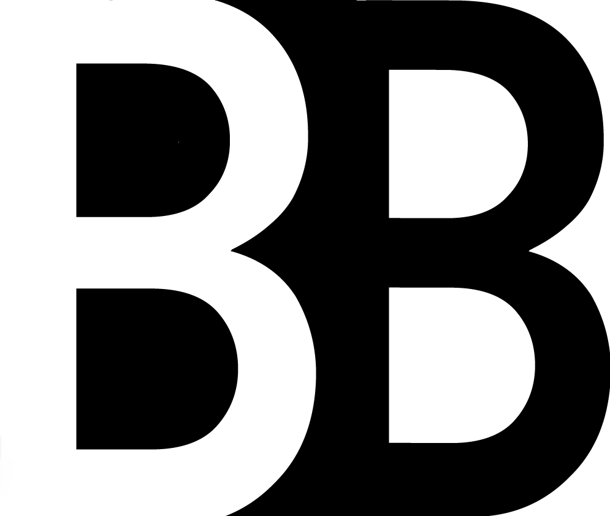

# Bienvenue sur le nouveau site de BackToBasics (B2B) !

Chers nouveaux élèves d'EPITA, c'est avec grand plaisir que nous vous accueillons sur le tout nouveau site de notre association, BackToBasics (B2B).
Nous avons créé ce site pour offrir une plateforme moderne, intuitive et accessible, où vous pourrez trouver toutes les informations nécessaires pour réussir vos premières années à EPITA (et les suivantes 😁).

### Pourquoi un nouveau site ?

Nous avons repensé notre site internet pour plusieurs raisons. Tout d'abord, nous voulions qu'il soit plus facile pour vous de trouver les ressources et informations dont vous avez besoin, que ce soit pour suivre des cours de soutien, participer à des sessions de tutorat, ou tout simplement en savoir plus sur nos activités (via ce blog).

Le nouveau site est conçu pour être responsive, c'est-à-dire qu'il s'adapte parfaitement à tous les supports, que vous soyez sur un ordinateur, une tablette ou un smartphone.

## A très vite !

Pour plus d'informations, explorez notre site, inscrivez-vous à nos événements et n'hésitez pas à nous contacter si vous avez des questions. Nous avons hâte de vous rencontrer et de vous aider à réussir vos études à EPITA.

À très bientôt,

**L'équipe BackToBasics**

